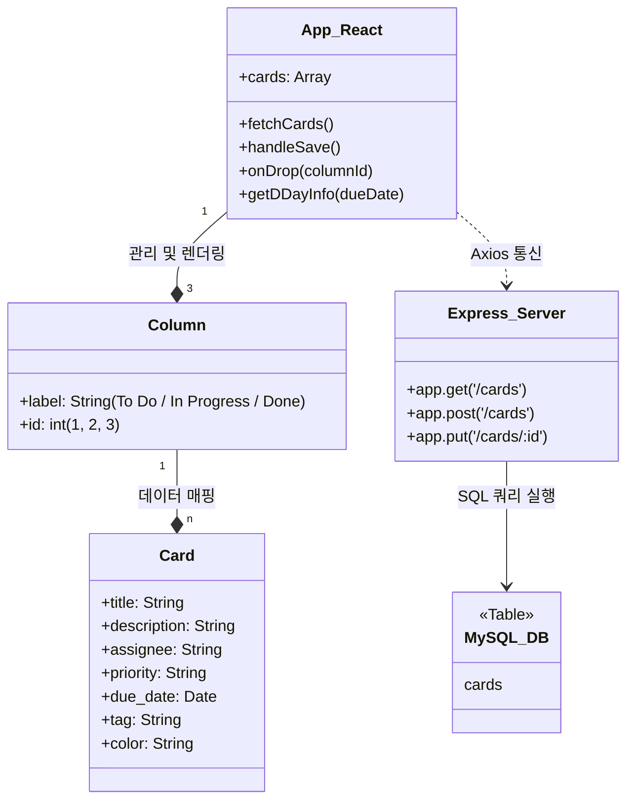
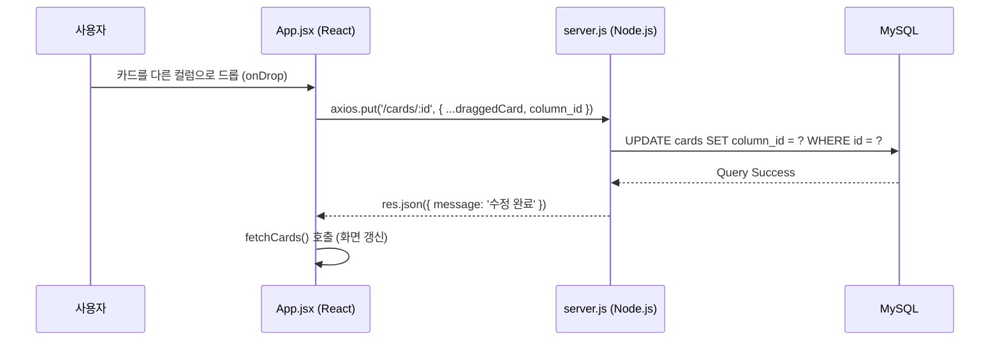
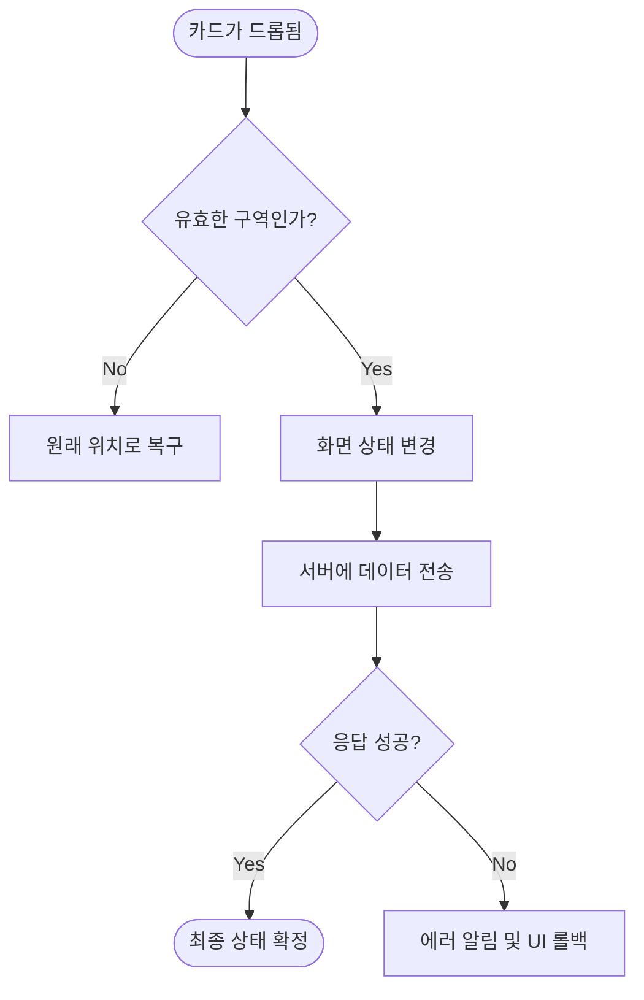
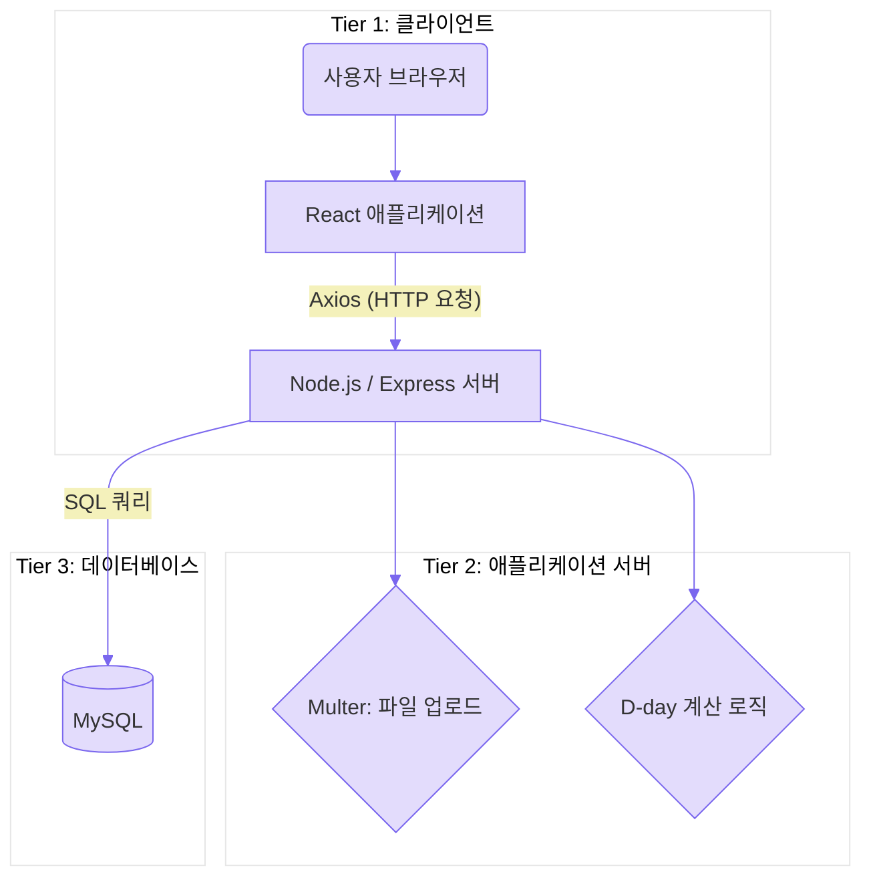

1. 실험의 목적 및 범위

1.1 목적
본 프로젝트는 게임 개발 파이프라인(기획, 에셋 제작, 스크립트 작성 등)에서 발생하는 복잡한 작업 과정을 시각적으로 체계화하여 관리할 수 있는 시각적 협업 툴을 개발하는 것을 목적으로 함.

React와 REST API를 활용한 비동기 데이터 통신을 통해 사용자에게 끊김 없는 작업 환경을 제공하고, 개발 지연 요소를 실시간으로 파악하여 게임 개발의 생산성을 극대화하고자 함.

1.2 범위 (구현 기능)
1) 카드 데이터 구성
- 기본 정보: 카드 제목, 상세 설명, 카드 색상
- 일정 관리: 진행 예정일, 목표 마감일, D-day
- 분류 및 우선순위: 담당자, 태그, 중요도(우선순위) 설정
- 에셋 관리: 외부 첨부 링크, 에셋 이미지 업로드 및 미리보기

2) 시스템 주요 기능
- 카드 상세 내용 보기 패널: 카드 클릭 시 우측 슬라이드 패널을 통해 상세 정보를 조회 및 수정할 수 있는 기능.
- 작업 상태 이동(드래그 앤 드롭): 드래그 앤 드롭 방식을 이용한 카드의 작업 상태(To Do, In Progress, Done) 변경 기능.
- 맞춤형 정렬 및 필터링: 카드 제작순, 마감일순, 중요도순으로 카드를 정렬하거나, 특정 담당자 및 태그를 선택하여 필요한 작업만 골라볼 수 있는 기능.
- 진행 현황 시각화: 전체 작업 진행률을 시각화하고, 마감 기한에 따라 4단계로 변하는 D-day 기능.

1.3 제외 범위 (불포함 내용)
- 검색 기능: 키워드를 통한 카드 검색 기능.
- 로그인 기능: 개인용 도구 목적에 따른 사용자 인증 및 회원가입 기능.


2. 분석
2.1 유스케이스

  
2.2 시스템 상세 명세

| 기능명 | 세부 요구사항 및 동작 명세 | 중요도 |
| :--- | :--- | :---: |
| **카드 관리 (CRUD)** | 새로운 작업을 등록하고 내용을 수정하거나 삭제함. 모든 데이터는 DB와 실시간으로 연동됨. | 상 |
| **상세 정보** | 제목, 마감일, 담당자, 우선순위, 참고 링크, 에셋 이미지 등 프로젝트 관리에 필요한 정보를 카드에 저장. | 상 |
| **드래그 앤 드롭** | 드래그 앤 드롭을 통한 상태 변경(To Do/In Progress/Done) 및 상세 정보 패널 제공. | 상 |
| **정렬 및 필터링** | 카드 제작순, 마감일순, 중요도순 정렬 및 담당자/태그별 필터링 기능. | 중 |
| **D-day 및 진행률** | 마감 기에 따른 4단계 D-day 색상 알림 및 전체 작업 진행률 시각화 | 상 |


3. 설계

3.1 클래스 다이어그램



3.2 순서 다이어그램


3.3 순서도: 드래그 앤 드롭 상태 변경 로직

드래그 앤 드롭 시 발생하는 UI 업데이트 및 예외 처리 로직


3.4 프로그램 구조 및 핵심 로직 설계
1) 프로그램 전체 구성 
- 전체 구조: 화면(React), 서버(Node.js), 데이터베이스(MySQL)가 서로 연결되어 작동하는 방식.
- 데이터 흐름: 사용자가 화면에서 움직이면 → 서버에 요청을 보내고 → 서버가 DB에 내용을 저장하는 순서로 진행.
- 데이터 관리: App.jsx에서 모든 카드 데이터를 관리하고, 아래 컴포넌트들에 전달해서 화면을 똑같이 맞춤.

2) 드래그 앤 드롭 로직
카드를 끌어서 다른 칸으로 옮길 때 서버에 바뀐 위치를 저장하는 과정
- 입력 데이터: 옮기려는 카드 정보, 새로 옮겨진 칸의 번호
  
- 실행 순서:
  - 체크: 옮길 카드가 없거나, 원래 있던 칸에 그대로 두면 아무 일도 안 하고 종료.
  - 날짜 맞추기: 날짜가 이상하게 변하지 않도록 '연-월-일' 형식으로 똑같이 맞춤.
  - 위치 저장: 서버에 카드의 위치를 바꿔달라고 요청.
  - 새로고침: 저장이 성공하면 화면을 다시 불러와서 카드가 옮겨진 상태를 보여줌.
  
- 슈도코드
```
ALGORITHM 카드_위치_변경(목표_칸_번호)
    // 1. 제대로 옮겼는지 확인
    IF (카드가 없거나 이미 그 칸에 있는 경우) THEN
        그냥 끝냄
    
    BEGIN TRY
        // 2. 바뀐 정보 서버에 보내기
        보낼데이터 = [현재 카드 복사본]
        보낼데이터의 [칸 번호]를 [목표_칸_번호]로 바꿈
        
        서버에 이 데이터를 업데이트해달라고 요청함
        
        // 3. 화면 업데이트
        IF (저장 성공) THEN
            서버에서 전체 카드를 다시 가져와서 화면을 바꿈
            잡고 있던 카드 정보를 비움
    END TRY
    BEGIN CATCH
        "옮기기 실패" 메시지를 띄움
    END CATCH
END ALGORITHM
```

3) 카드 내용 저장 로직
새 카드를 만들거나 내용을 고칠 때, 이미지가 있는지 확인해서 서버에 저장함.

- 실행 순서:
  - 입력 확인: 카드 제목을 안 적었으면 제목 적으라고 알려주고 중단함.
  - 전송 방식 선택
     1. 이미지가 있을 때: 이미지 파일과 글자를 같이 묶어서 전송.
     2. 이미지가 없을 때: 그글자 데이터만 보냄.
  - 마무리: 저장이 끝나면 입력창을 닫고 카드가 바뀐 화면을 보여줌.

- 슈도코드
```
FUNCTION 카드_저장하기():
    // 1. 제목 썼는지 확인
    IF (제목이 비어있음) THEN:
        "제목 입력 필요" 알림 띄우고 멈춤

    TRY:
        // 2. 이미지 유무에 따라 다르게 보내기
        IF (내용 수정 중임):
            IF (이미지 파일이 있음) THEN:
                이미지랑 글자를 같이 묶어서 서버로 보냄
            ELSE:
                글자 내용만 서버로 보냄
        ELSE (새로 만드는 중임):
            이미지와 전체 내용을 하나로 묶어서 서버로 보냄

        // 3. 화면 정리
        카드 리스트를 다시 불러옴
        입력창을 비우고 닫음
    CATCH Error:
        "저장 실패" 메시지 표시
END FUNCTION
```

4. 구현
4.1 개발 및 운영 환경
- 개발 도구: Visual Studio Code, Git, GitHub Desktop
- 프론트엔드: React, Axios, CSS3 
- 백엔드: Node.js, Express
- 데이터베이스: MySQL 

4.2 시스템 아키텍처 


4.3 핵심 API 명세
| 기능명 | Method | Endpoint | 역할 |
| :--- | :---: | :--- | :--- |
| **카드 생성/업로드** | POST | `/cards` | 새로운 카드 및 이미지 에셋 DB 추가 |
| **전체 카드 조회** | GET | `/cards` | 전체 카드 리스트 불러오기 |
| **내용 및 상태 수정** | PUT | `/cards/:id` | 카드 내용 수정 및 드래그 앤 드롭 상태 변경 |
| **카드 삭제** | DELETE | `/cards/:id` | 특정 ID의 카드 삭제 |


5. 실험 및 결과

5.1 테스트 데이터 구성
프로젝트의 기능 검증을 위해 실제 게임 개발 파이프라인을 상정한 가상의 작업 데이터를 입력하여 테스트를 진행.
- 담당자 데이터: 이승빈, 김철수, 박지민
- (태그): 기획, 아트, 프로그래밍, 디자인
- 에셋 데이터: 실제 이미지 파일(png, jpg) 및 외부 참고 URL 활용
- 테스트 케이스: 캐릭터 원화 제작(아트), 메인 UI 레이아웃(기획), 서버 DB 스키마 설계(프로그래밍) 등 총 10개 이상의 카드 데이터 등록

5.2 기능별 테스트 시나리오 및 결과
| 테스트 항목 | 테스트 시나리오 및 조작 | 기대 결과 | 결과 |
| :--- | :--- | :--- | :---: |
| **카드 생성 (Multipart)** | 제목 입력 및 이미지 파일을 첨부하여 카드 생성 버튼 클릭 | DB에 텍스트 데이터가 저장되고, `uploads/` 폴더에 이미지 파일이 정상적으로 기록됨. | 성공 |
| **카드 생성 (JSON)** | 이미지 첨부 없이 텍스트 정보(제목, 설명 등)만 입력하여 카드 생성 | image_url는 `null`로 처리되며, 일반 텍스트 데이터만 DB에 안전하게 저장됨. | 성공 |
| **드래그 앤 드롭** | 보드 화면에서 카드를 작업상태 To Do 에서 In Progress 으로 마우스 드래그 | 서버로 `PUT` 요청이 전송되어 해당 카드의 `column_id` 값이 1에서 2로 즉시 업데이트됨. | 성공 |
| **이미지 미리보기** | 생성된 카드 내의 이미지 아이콘 또는 썸네일에 마우스 호버 조작 | 서버의 정적 자원 경로를 통해 업로드되었던 에셋 이미지가 팝업 또는 카드 내에 표시됨. | 성공 |
| **상세 내용 수정** | 카드 클릭 시 나타나는 슬라이드 패널에서 색상, 담당자, 중요도 정보를 변경 후 저장 | 수정된 데이터가 DB의 해당 레코드에 즉시 반영되고, 보드 화면이 최신 상태로 갱신됨. | 성공 |
| **데이터 삭제** | 특정 카드의 삭제 버튼 클릭 후 나타나는 확인 모달창에서 승인 선택 | 서버로 `DELETE` 요청이 전달되어 DB에서 해당 ID의 데이터가 제거되고 화면에서 사라짐. | 성공 |

5.3 데이터베이스(MySQL) 연동 확인
백엔드 서버와 데이터베이스가 서로 데이터를 정확하게 주고받는지 점검.
- 실시간 저장 확인: 화면에서 카드를 만들거나 옮기면, MySQL Workbench에서도 그 내용이 즉시 바뀌어 저장되는 것을 확인.
- 데이터 저장 규격: 날짜, 긴 설명글, 숫자 데이터 등이 정해진 형식에 맞춰 칸마다 정확하게 기록됨을 확인.

5.4 최종 구현 결과물
- 종합 결과: 처음에 계획했던 대로 화면, 서버, 데이터베이스가 서로 끊김 없이 연결되어 모든 기능이 오류 없이 작동함.
- 사용 편의성: 드래그 앤 드롭으로 카드의 작업 상태를 바꾸고, 수정된 내용이 화면에 바로 나타나게 하여 누구나 쉽게 작업을 관리할 수 있도록 구현함.


6. 결론
   
6.1 프로젝트 성과 요약
- 목표 달성: 게임 개발 과정을 한눈에 보고 관리할 수 있는 시스템을 만듦.
- 기능 구현: 카드 상태 변경(드래그 앤 드롭), 이미지 업로드, 상세 수정 등 핵심 기능 완성.
- 작동 확인: 화면과 서버, DB가 끊김 없이 연결되어 데이터가 실시간으로 잘 저장되는 것을 확인.

6.2 앞으로의 계획
- 기능 추가: 검색 기능과 로그인 기능 추가
  
